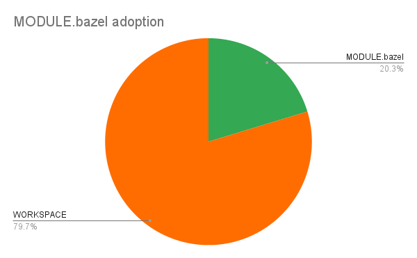
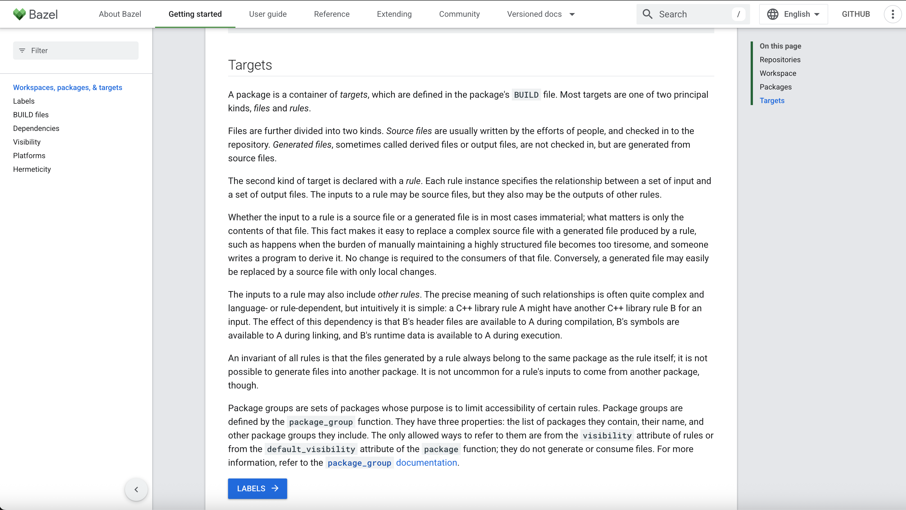
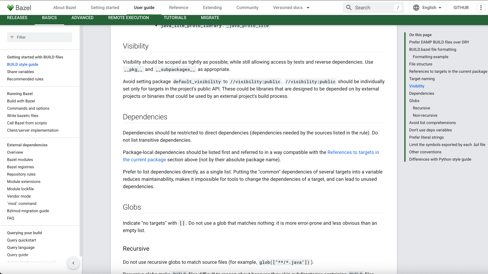
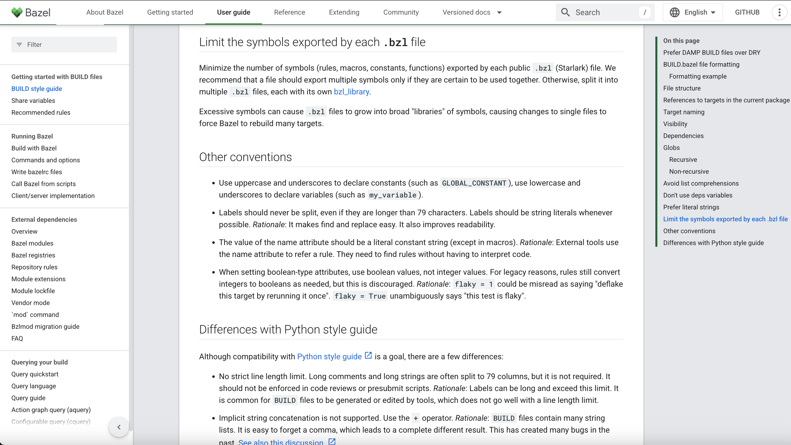
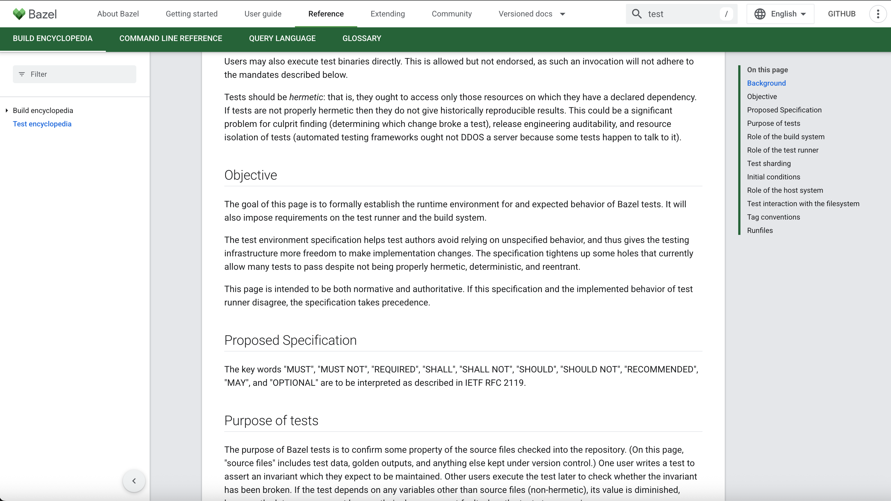
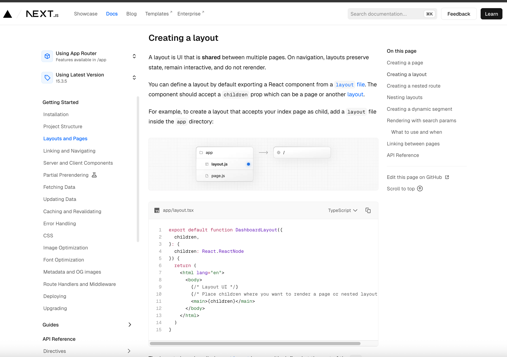

> It's pronounced "bay-zuhl" (like "hazel" with a "B"). 
> /ˈbeɪ.zəl/

This post presents specific, actionable ideas for improving [Bazel's main documentation website](https://bazel.build/docs), with the goal of boosting adoption and enhancing the developer experience. Like any open source project, Bazel is the result of real human effort—this is offered in the spirit of a naive proposal to help make the project even better.

There are many parts of the Bazel documentation that are quite good and we should salvage those. This post targets the poor sections of the documentation that eclipse the good parts. 

### 🧭 Introduction: The Pain Is Real

One day, after spending hours scouring the official Bazel documentation and countless Github issues for `rules_python`, `rules_distroless` and `bazel-build/bazel`, I stumbled upon the reddit post that made me chuckle out loud: [bazel is ruining my life](https://www.reddit.com/r/devops/comments/1c2g3s4/bazel_is_ruining_my_life/).  

Apparently this is a fairly well known rant-post; but what caught my eye is that most of the comments gravitate toward a shockingly poor documentation experience. I'm worried how many other folks rage-quit Bazel

Here are some zingers:

> The documentation is terrible because it includes no examples or samples. It’s just dry Java‑style reference documentation. 
Bazel is now in my pile of "do not touch, may drive you insane". It's sad because it did give us a very quick delta compilation 
> — [u/gretro450](https://www.reddit.com/r/devops/comments/1c2g3s4/bazel_is_ruining_my_life/hn0tk5q)

> I invested several weeks in learning Bazel and the documentation was just utterly horrendous to work with.
> — [u/ReginaldIII](https://www.reddit.com/r/devops/comments/1c2g3s4/bazel_is_ruining_my_life/hm3qxyz)

I won't go through all of the comments but the majority share in the frustration of how difficult it is to understand how Bazel works and how to apply the information in the documentation.

#### What about migration to Bazel 7 release adoption?

I ran a fun experiment on Github's [Code Search](https://github.com/search?q=path%3AWORKSPACE+AND+language%3AStarlark&type=code) functionality. I wanted to quickly find out how many files (and by proxy repositories) had adopted `MODULE.bazel` vs `WORKSPACE`. The results are below and while Github doesn't allow to searching for repositories based on paths, this is the closest I got.

| Search Query                                      | Matching Files | 
|--------------------------------------------------|-------------------|
| `path:WORKSPACE AND language:Starlark`                | **47,900**  | 
| `path:MODULE.bazel AND language:Starlark`                | **12,200**  |

Or in a way that is easier to grok:

    

*Approximate share of repos using `WORKSPACE` vs `MODULE.bazel` based on GitHub code search results.*

What is interesting is that almost **80%** of Bazel projects have not yet fully migrated to Bazel 7.  According to [Bazel docs on migration](https://bazel.build/external/migration):
> The WORKSPACE file is already disabled in Bazel 8 (late 2024) 

Even though Bazel 8 is already out, the majority of projects are still using WORKSPACE. This could be due to many reasons, but I think one of the main reasons is fear of breaking things and inability to access good migration documentation. Good documentation instills confidence.

### 🫡 Message Received: But, what exactly is broken?

 While Bazel relies on a lot of key pieces of documentation depending on your repo (i.e. specific docs for `rules_xyz` repos), I'll focus on the main [https://bazel.build/docs](https://bazel.build/docs) website which I will call `Bazel docs` from here on out. Here's a look at what general areas are problematic on `Bazel docs`.

1. **Structure**. The structure of the `Bazel docs` is jarring to a beginner because it's not properly structured in a way that is conducive for incremental learning.  Based on [Diátaxis](https://diataxis.fr/start-here/)' recommendation here are the four main structures of a powerful documentation stack:
    - Tutorials
    - Explanation
    - How-To Guides
    - Reference
    
    In the case of `Bazel docs` the structure is as follows:

    - Releases
    - Basics
    - Advanced
    - Remote Execution
    - Tutorials
    - Migrate

    When a prospective Bazel beginner lands on `Bazel docs` homepage they immediately become overwhelmed just based on the categories displayed.

2. **Language and Tone**. Many pages of `Bazel docs` assumes the reader is already an expert. This is partly because the structure doesn't help the reader distinguish between the Reference and Explanation (cognition) from the Tutorial and How-To Guide (action) sections. For example, the  [very first paragraph](https://bazel.build/build/style-guide#prefer-damp-build-files-over-dry) of the `BUILD Style Guide` which is the first section after `Releases`, doesn't explain why you should care about BUILD files or what they really are; it immediately dives into how you should style them. As if it's a given what a BUILD file is.

3. **Search and Discoverability**. When developers are stuck on a specific error or concept, they can't easily find the right documentation resources after a quick Google search or ChatGPT prompt. The best place to find errors has been:
    <ol type="a">
      <li>
        <a href ="https://bazelbuild.slack.com/join/shared_invite/zt-364or18jk-7whaXBiCdZVhC7v2FCq3xw#/shared-invite/email">Bazel Slack Channel</a>
      </li>
      <li>
        Github Repo Issues
      </li>
    </ol>

4. **"Show, Don't Tell" Problem**. When trying to implement a new concept or fix an error in your Bazel build, there are many places in the documentation where a wall of text is provided with no relevant examples to help developers pattern match.  Here are some examples:

|  |  |
|:-----------------------------:|:-----------------------------:|
|  |  |

*From left to right, top to bottom: Target concepts explained without BUILD file examples; Visibility and dependencies described abstractly without code samples; .bzl file functionality outlined without actual Starlark code; Test Encyclopedia entries that define terms but don't show working test configurations.*

### 🛠️ The Fix: Concrete Steps to Transform Bazel Documentation

Just like everything else in engineering, we should start with a design and a proposal so here is a proposal to improve the main `Bazel docs`

1. **Improve Structure for https://bazel.build/docs**. The proposed structure for the **four** main categories of documentation. The actual contents of each of the categories is totally arbitrary but just added some in no particular order as a contextual example.

2. **Identify and Re-Organize Narrative**. There are many great parts of the documentation that are great as is. In fact, many could slot right into the Explanation section of the proposed design. Others could use some wordsmithing to improve the understandability for new-comers.

3. **Inventory Issues and Address Them** Many pitfalls and issues that developers run up against are hidden in the [Bazel Slack Channel](https://bazelbuild.slack.com/join/shared_invite/zt-364or18jk-7whaXBiCdZVhC7v2FCq3xw#/shared-invite/email). The great news is that many solutions to these problems are already written there! Using a Large Language Model (LLM) or an interface like [Onyx](https://www.onyx.app/) could be an incredibly power start to surface these frequent issues.

4. **More Examples Everywhere**. Finally, we all know how useful examples are. We simply need more of them everywhere.
As a matter of fact I will use an example to drive this point home. Looking at an example of great documentation is the Next.js project. I just picked a random page called "[Creating a Layout](https://nextjs.org/docs/app/getting-started/layouts-and-pages)". This is what was rendered:

It is explained like I'm an alien that just landed on planet Earth and it includes a simple but confidence-inspiring example on how to create a layout. It also has a diagram to help us get a mental model of how it works contextually.

### 🚀 Let's Make This Happen

This isn't just another rant post—it's a roadmap. The Bazel community is full of talented developers who've figured out very complex things already! We also have great solutions to these documentation problems in isolation. It's time we pooled that knowledge.

**What you can do:**
- Share your own Bazel documentation pain points on [Bazel Slack Channel](https://bazelbuild.slack.com/join/shared_invite/zt-364or18jk-7whaXBiCdZVhC7v2FCq3xw#/shared-invite/email) and link this blog post.
- Contribute examples to the official docs when you solve problems 
- Join the conversation at BazelCon 2025 (if this proposal gets accepted!)

The 80% migration gap isn't just a number—it represents thousands of developers who want to use Bazel but are held back by unclear documentation. Better docs aren't just nice-to-have; they're essential for Bazel's future growth.

Should we just do it?
