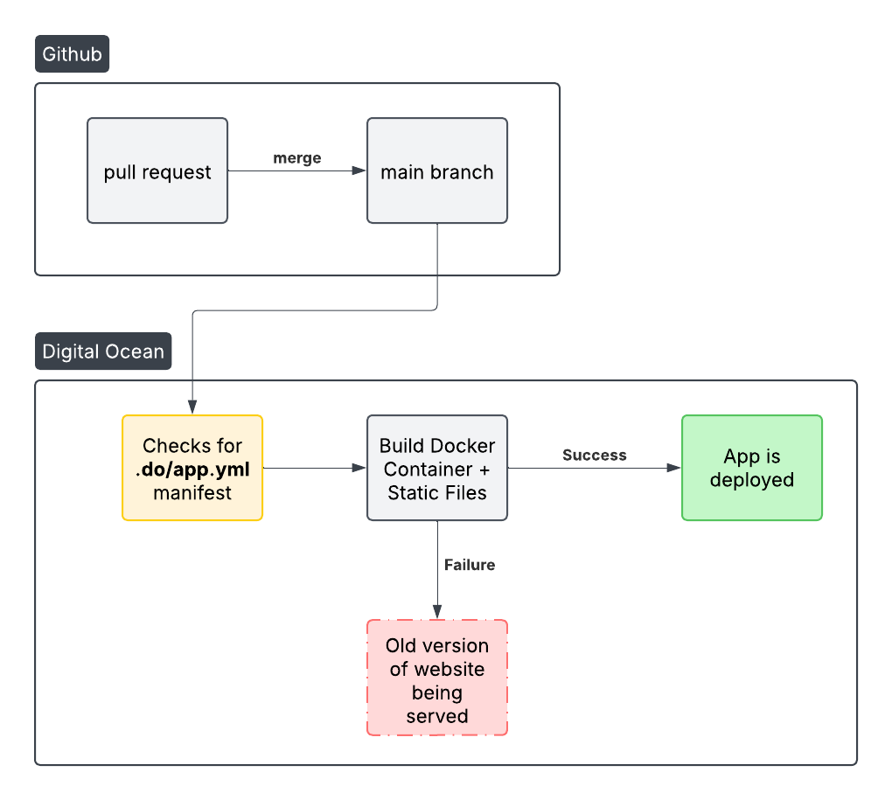
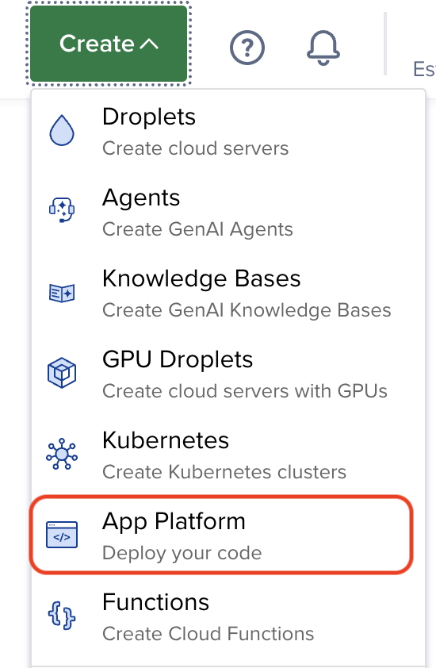
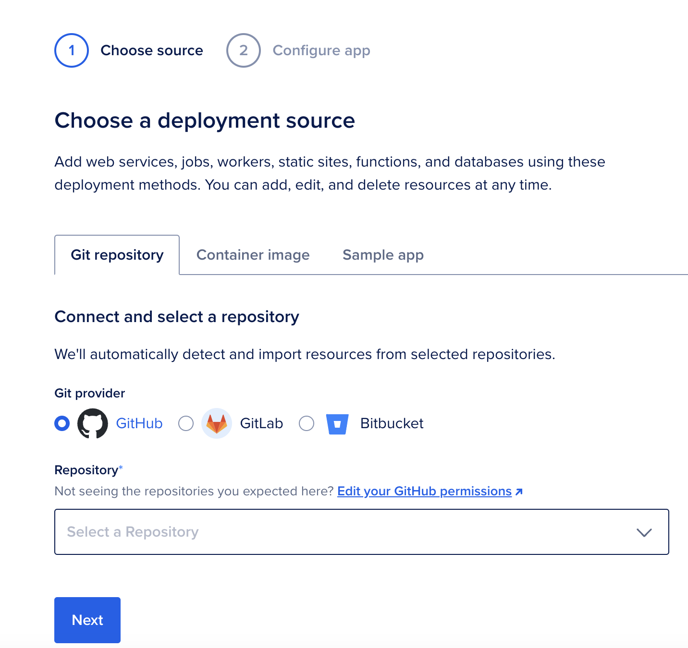
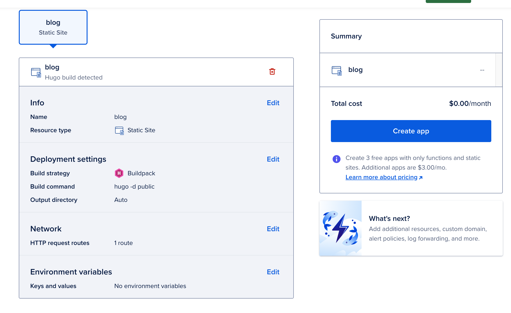

### TL;DR
This blog post provides a step-by-step guide to creating and deploying a static website for free using [DigitalOcean's App Platform](https://www.digitalocean.com/products/app-platform). This blog ([https://alanmond.com](https://alanmond.com)) serves as a practical example.

### Background
DigitalOcean has filled the gap left open by AWS, GCP, and Azure to provide a user-friendly interface to deploy cloud resources. With time, Digital Ocean has added multiple managed products:
    
| Feature             | DigitalOcean              | AWS                        | GCP                      |
|---------------------|--------------------------|----------------------------|--------------------------|
| Compute            | Droplets                  | EC2                        | Compute Engine          |
| Managed Kubernetes | DigitalOcean Kubernetes  | EKS                        | GKE                      |
| Storage            | Spaces (Object Storage)   | S3                         | Cloud Storage           |
| Database Services  | Managed Databases        | RDS, DynamoDB              | Cloud SQL, Firestore    |
| Serverless        | App Platform             | Lambda, Amplify            | Cloud Functions         |
| Networking        | Floating IPs, VPC        | VPC, Elastic Load Balancer | VPC, Load Balancer      |

### How it works
Deploying code with DigitalOcean is straightforward once your GitHub repository is connected. Here's a high-level overview:
1. Set up a GitHub repository
2. Create a pull request (PR)
3. Merge the PR into your main branch
4. DigitalOcean checks for app configurations
5. DigitalOcean builds static files
6. Your app is deployed!

The diagram below illustrates the deployment workflow:



### Step by Step Implementation
1. Create a Github repo. You are welcome to fork [https://github.com/alan707/blog](https://github.com/alan707/blog) to get started.
2. Create a DigitalOcean account.
3. To make life easier, create a file call `app.yaml` under a new folder called `.do` at the root of your repo.  It should look like this:
```sh
.do
└── app.yaml
```
Inside the `app.yaml` file, add the following yaml contents customizing anything inside these brackets `< >`
```yaml
alerts:
- rule: DEPLOYMENT_FAILED
- rule: DOMAIN_FAILED
domains:
- domain: <enter_your_domain_here>
  type: PRIMARY
  zone: <enter_your_domain_here>
features:
- buildpack-stack=ubuntu-22
ingress:
  rules:
  - component:
      name: blog
    match:
      path:
        prefix: /
name: <the_name_of_your_app>
region: nyc
static_sites:
- dockerfile_path: ./Dockerfile
  github:
    branch: main
    # this will deploy each time you push (recommended)
    deploy_on_push: true
    repo: <name_of_your_github_repo>
  name: blog
  output_dir: /workspace/public
  source_dir: /
```
4. Now back to DigitalOcean.com, click on the big <span style="color:rgb(21,107,53)">GREEN</span> button that says Create and click on App Platform.
5. 
6. Once you are on the Create New App page, choose Github as the deployment source and select the repository you'd like to listen to when pushing changes. In my case it was `alan707/blog` and the branch was `main`, but you can set that to anything. 
7. Click on "Next"
8. This will take you to the next page where you can review details and finally hit the *Create app* button to create your app. Make sure you delete any additional services so your monthly cost is set to **$0.00/month**!

9. Once your app is created, you can simply deploy to the branch specified in step 5 and you will see your build go through.

I highly recommend managing all your configurations via the `.do/appyaml` file to make sure everything is captured on your repo and you don't rely on remembering DigitalOcean's settings.