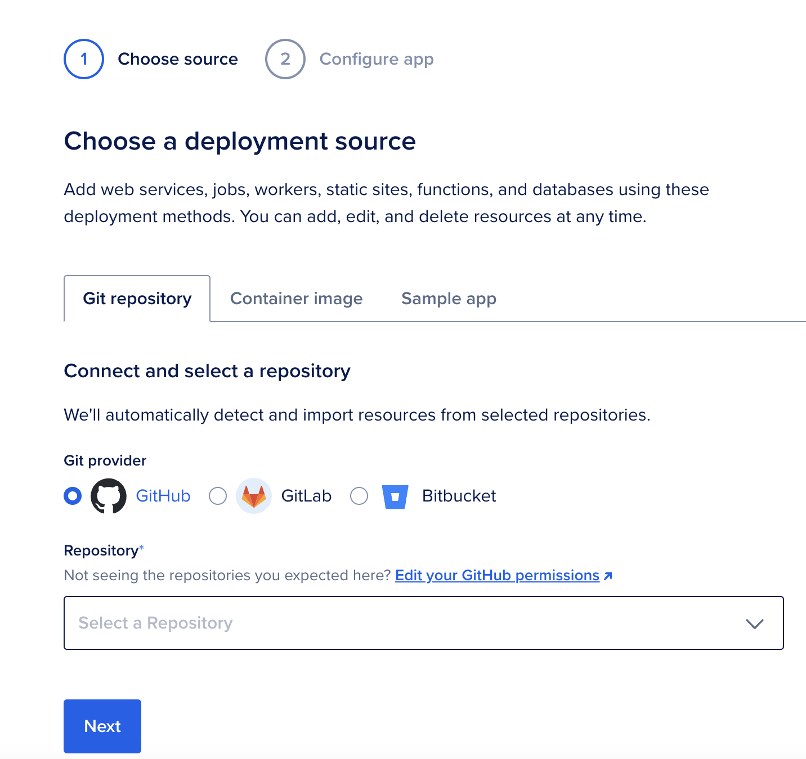

### TL;DR
This blog post will walk through step by step how to create a static website for free using [Digital Ocean's App Platform](https://www.digitalocean.com/products/app-platform). This blog [https://alanmond.com](https://alanmond.com) will be used as a functioning example on how to do that.

### Background
Digital Ocean has filled the gap left open by AWS, GCP, and Azure to provide a user-friendly interface to deploy cloud resources. With time, Digital Ocean has added multiple managed products:
    
| Feature             | DigitalOcean              | AWS                        | GCP                      |
|---------------------|--------------------------|----------------------------|--------------------------|
| Compute            | Droplets                  | EC2                        | Compute Engine          |
| Managed Kubernetes | DigitalOcean Kubernetes  | EKS                        | GKE                      |
| Storage            | Spaces (Object Storage)   | S3                         | Cloud Storage           |
| Database Services  | Managed Databases        | RDS, DynamoDB              | Cloud SQL, Firestore    |
| Serverless        | App Platform             | Lambda, Amplify            | Cloud Functions         |
| Networking        | Floating IPs, VPC        | VPC, Elastic Load Balancer | VPC, Load Balancer      |

### How it works
Once you connect your Github repo to Digital Ocean, deploying code is incredibly easy. In the next section I will walk through all the details, but the gist is:
1. set up a Github repo
2. create a PR
3. merge PR into your main branch
4. Digital Ocean checks for app configs
5. Build static files
6. App Deployed!

The diagram below provides the end-to-end flow on how the deployment works under the hood.

### Step by Step Implementation
1. Create a Github repo. You are welcome to fork [https://github.com/alan707/blog](https://github.com/alan707/blog) to get started.
2. Create a Digital Ocean account
3. Once on Digital Ocean and click on the big GREEN button that says Create.
4. 
5. Once you are on the Create New App page, choose Github as the deployment source and select the repository you'd like to listen to when pushing changes. In my case it was `alan707/blog` and the branch was `main`, but you can set that to anything. 
6. Click on "Next"
7. This will take you to the next page where you can review details and finally hit the *Create app* button to create your app. Make sure you delete any additional services so your monthly cost is set to **$0.00/month**!

8. Once your app is created, you can simply deploy to the branch specified in step 5 and you will see your build go through.